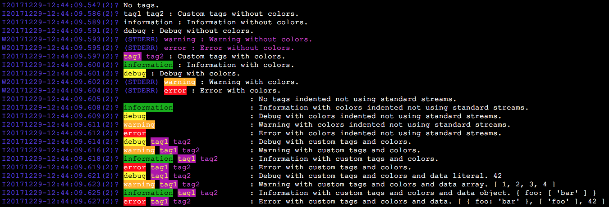

# meteor-logs

Cross platform, pretty, filtered, polymorphic, console and database logging for Meteor.

Features include filtered color tags, managed io-streams and indenting on the console. Cross platform logs are stored in MongoDB and presented to admin users using Blaze templates.

Ideal for test driven development, logging intensive applications, and production monitoring.

Logs can be created from anywhere in client or server code, startup and runtime,
even inside methods. Logs with debug tags are automatically and completely
ignored on production environments. Logs with error tags automatically throw errors, and cross platform logs are only accessible by Meteor users with admin
roles.

Templates are included for logging from Blaze templates, and for searching and
presenting filtering logs. (Coming Soon)

## Sponsor

> **Thank You** This open source library was created by [ExpertBox.com](http://www.ExpertBox.com) as a 'thank you' to the Open Source community.

## Showcase




```
Log.log([], 'No tags.');

Log.log(['tag1', 'tag2'], 'Custom tags without colors.');

Log.info('Information without colors.');
Log.debug('Debug without colors.');
Log.warn('Warning without colors.');
try {Log.error('Error without colors.');} catch (e) {}

Log.color('error', 'white', 'red');
Log.color('warning', 'white', 'orange');
Log.color('information', 'black', 'green');
Log.color('debug', 'black', 'yellow');
Log.color('error', 'white', 'red');
Log.color('tag1', 'yellow', 'purple');
Log.color('tag2', 'purple');

Log.log(['tag1', 'tag2'], 'Custom tags with colors.');

Log.info('Information with colors.');
Log.debug('Debug with colors.');
Log.warn('Warning with colors.');
try {
  Log.error('Error with colors.');
}
catch (e) {}

Log.messageIndent(25);
Log.standardStreams(false);

Log.log([], 'No tags indented not using standard streams.');
Log.info('Information with colors indented not using standard streams.');
Log.debug('Debug with colors indented not using standard streams.');
Log.warn('Warning with colors indented not using standard streams.');
try {
  Log.error('Error with colors indented not using standard streams.');
}
catch (e) {}

Log.log(['debug', 'tag1', 'tag2'],
    'Debug with custom tags and colors.');
Log.log(['warning', 'tag1', 'tag2'],
    'Warning with custom tags and colors.');
Log.log(['information', 'tag1', 'tag2', ],
    'Information with custom tags and colors.');
try {Log.log(['error', 'tag1', 'tag2'],
    'Error with custom tags and colors.');} catch (e) {}

Log.log(['debug', 'tag1', 'tag2'],
    'Debug with custom tags and colors and data literal.', 42);
Log.log(['warning', 'tag1', 'tag2'],
    'Warning with custom tags and colors and data array.', [1,2,3,4]);
Log.log(['information', 'tag1', 'tag2', ],
    'Information with custom tags and colors and data object.', {foo: ['bar']});
try {
  Log.log(['error', 'tag1', 'tag2'],
    'Error with custom tags and colors and data.', [{foo: 'bar'}, ['foo'], 42]);
}
catch (e) {}
```

## Polimorphic

Works the same anywhere in a Meteor client or server
```
Log.info('All logs on the server and client (except debug on prod) are stored '+
    'in the \'Log\' MongoDB collection.');
Meteor.onStartup(() => {
  Meteor.methods({myMethod: ()=>{Log.info('wow')}};
  if (Meteor.isServer) {
    Log.info('Logs on the server does not show on the client console');    
  }
  else if (Meteor.isClient) {
    Log.info('Logs on the client does not show on the server console');
    Meteor.call('myMethod');
  }
});
```

## Managed console log streams

Shorthand is handy for quick easy logging.
```
Log.info('Log on console info stream and the database.');
Log.warn('Log on console warning stream and the database.', 7);
Log.error('Log on console error stream and the database', {foo: 'bar'});
Log.debug('Log on console debug stream and the database', 'some', 'data');
```

Shorthand Resolves to default system managed log streams:
```
console.log(' information : Log on console info stream and the database.');
console.warn(' warning : Log on console info stream and the database.', 7);
console.error(' error : Log on console error stream and the database',
    {foo: 'bar'});
console.log(' debug : Log on console error stream and the database',
    'some', 'data');
```

Special purposes tags are used when custom tags are added (information, warning,
error, debug):
```
Log.log(['information'], 'Log on console info stream and the database.');
Log.log(['warning', 'nonSpecialTag', 'anotherTag'],
    'Log on console warning stream and the database.', 7);
Log.log(['error', 'someTag'], 'Log on console error stream and the database',
    {foo: 'bar'});
Log.log(['debug', 'tag1'], 'Log on console error stream and the database',
    'some', 'data');
```

Disable standard streams to work well with indents, default is true. When
standard streams are not used, all console logs are on the standard log stream, this includes errors and warnings.
```
Log.standardStreams(false);
```

## Message Indenting

To improve message readability, indenting can be used, default is 0. When using indents it helps to disable standard streams to remove all decorations consoles add for STDERR stream.
```
Log.standardStreams(false);
Log.messageIndent(25);
```

## Smart Debug

Debug logs are completely auto ignored in production environments
```
Log.debug('Debug logs are completely auto ignored in production environments',
    {foo: ['bar']}, loads, ofOther, objects, andLiterals);
Log.log(['debug', 'someFeature'],
    'Debug logs are completely auto ignored in production environments',
    {foo: ['bar']}, 'loads of other objects and arrays and literals',
    ['A', 'B', {C: 'C'}] , 42);
```

## Smart Errors

Logging an error automatically throws an exception.

## Tag filtering on the console

Logs than contain a tag can be easily silenced on the console. Note that muted
tags are still logged in database.
```
Log.mute('veryBusy');
Log.log(['veryBusy'], 'Muted logs do not show on the console');
Log.log(['veryBusy'], 'Muted logs are logged in the database.');
Log.show('veryBusy');
Log.log(['veryBusy'], 'And can be unmuted when appropriate');
```

## Color tags on the console

Easily change the color and background of a tag on the console.
```
Log.color('error', 'black', 'red');
Log.color('myTag', 'white', 'green');
Log.log(['error', 'myTag'], 'Colors can be added to any tag.');
Log.color('error');
Log.color('myTag', 'green', 'black');
Log.error('Colors can be reset or changed at any time');
```

Color tags are an optional feature. If you do not need it, then no need
to install or include Chalk.

Note that changing the color of a tag on the client does not change the color of
the tag on the server, unless it is done in imports/startup/both.

## Atmosphere Package

### Installation

On the console:
```
$ meteor npm import chalk --save
$ meteor add mozfet:meteor-logs
```

### Useage

In client or server code using the global object:
```
Log.info('Using Atmosphere makes it easy.');
```

## Node Package (Coming Soon)

### Installation

On the console (using chalk is optional):
```
$ meteor npm import chalk --save
$ meteor npm import meteor-logs --save
```

### Useage

Inside any code on the client or server:
```
import Log from 'meteor-logs';
Log.info('Using Node Package Manager makes it standard.');
```
